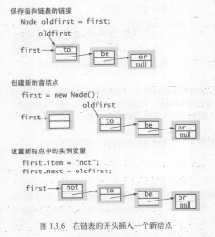
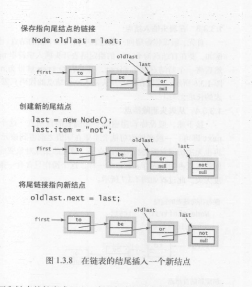

# Bag 

## 特点
只进不出，无序


# Queue
入队：插入链表尾，但是当是空队列新入队元素时，需要将fist和last指针都指向新节点
```Java
public void enqueue(Item item){
    Node oldLast = last;
    last = new Node();
    last.item = item;
    last.next = null;
    if(isEmpty()){
        // 空链表新入队，则将两个指针指向同一个元素
        fitsy = last;
    }else{
        oldLast.next = last;
    }
    N++;
}
```

出队：链表为空时需要更新last的值
```Java
public Item dequeue(){
    Item item = first.item;
    first = first.next;
    if(isEmpty()){
        last = null;
    }
    N--;
    return item;
}
```


# Stack
链表实现：使用头插法插入元素

# LinkedList

定义：链表是一种递归的数据结构，或者为空，或者指向另一个结点的引用。

## 在表头插入元素


```Java
Node old = first;
first = new Node();
first.item = val;
first.next = old;
// 这样保证了新链表的表头任然是first

// 或者

Node newFirst = new Node(val);
newFirst.next = first;
```

## 在表尾插入元素


```Java
Node oldLast = last;
last = new Node();
last.item = val;
oldLast.next = last;
// 这样保证了新链表的表尾任然是last

// 或者

Node newLast = new Node(val);
last.next = newLast;
```

## 从表头删除元素
`first = first.next`

## 遍历
```Java
while(node!=null){
    // function
    node = node.next;
}

// or 

for(Node node = first;node != null;node = node.next){
    // pass
}
```

