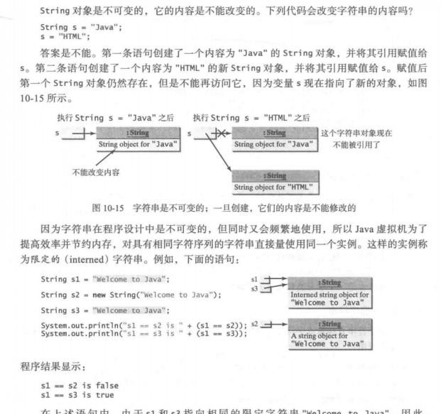

# 第十章
## 不可变字符串与限定字符串
String对象是不可变的，它的内容不可以改变，所以  
***String s1= "xzz";***  
***s1 = "haha";***  
其中"xzz"并没有消失，只是创建了一个新的对象new String("haha"),s1指向了这个新的对象，而”xzz"则失去了引用。  
而因为字符串在程序设计中经常被用到，所以JVM为了节省开销，对相同的字符串将指向同一个实例。  
