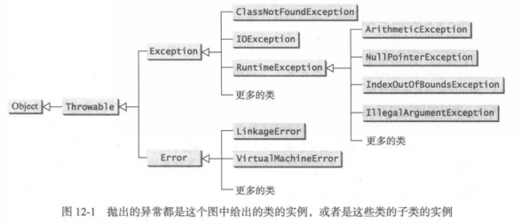
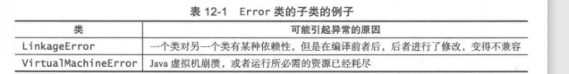
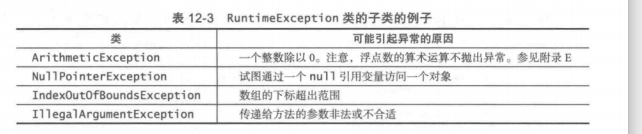
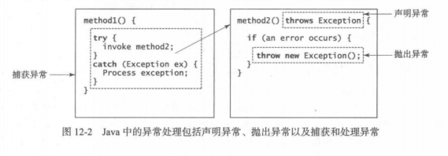
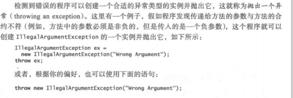
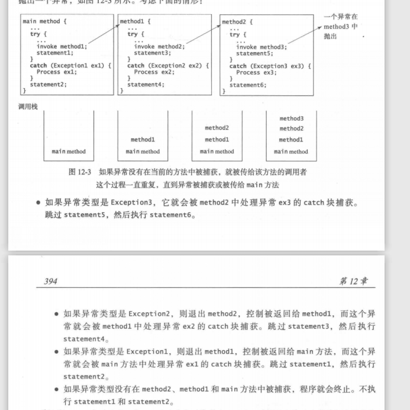
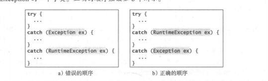

# Exception and IO

## 一.Exception

### 概述
异常是对象，而对象都采用类来定义。异常的根类是 java.lang.Throwable.  

异常常见的有：系统错误，异常和运行时异常：  
**系统错误**  
由JVM抛出，用Error类表示，描述内部系统错误。

**异常**  
用Exception类表示，描述由程序或者外部环境所引起的错误，这些错误可以被程序捕获和处理。如：ClassNotFoundException：试图使用一个不存在的类，IOException：输入/输出相关的操作，如无效的输入，读文件时超过了文件尾，打开一个不存在的文件等。  
**运行时异常**  
描述的程序设计错误，比如类型转换错误，数组越界或者数值错误。

在这里面Error和RuntimeException和他们的子类称作免检异常，编译器不强制他们使用try---catch块。 

### 异常处理流程
 Java的异常处理流程基于三种操作：声明一个异常、抛出一个异常、捕获一个异常
 
#### 1.声明异常
在Java中当前执行的语句必然属于某个方法，Java 解释器调用 main 方法开始执行一个程序。如果有**必检异常**，那么其方法必须要声明它可能抛出的异常，这个过程叫做***声明异常***  
因为任何代码都可能发生系统错误和运行时错误，因此，Java 不要求在方法中显式声明 Error 和 RuntimeException (免检异常）。  
但是，方法要拋出的其他异常都必须在方法头中显式声明，这样，方法的调用者会被告知有异常。关键字为***throws***，如下所示：  
***public void myMethod() throws IOException***  
关键字 throws 表明 myMethod 方法可齙会抛出异常 IOException。如果方法可能会抛出多个异常，就可以在关键字 throws 后添加一个用逗号分隔的异常列表：  
***public void myMethod() throws Exception_1，Exception_2...Exception_n***  
##### 2.抛出异常

通常，JavaAPI 中的每个
异常类至少有两个构造方法：一个无参构造方法和一个带可描述这个异常的 String 参数的构造方法。该参數称为异常消息（exceptionmessage), 它可以用 getMessage()获取。  
#### 3.捕获异常
如果在执行 try 块的过程中没有出现异常，则跳过 catch 子句。  
如果 try 块中的某条语句抛出一个异常，Java 就会跳过 try 块中剩余的语句，然后开始査找处理这个异常的代码的过程。处理这个异常的代码称为**异常处理器**（exception handler);可以从当前的方法开始，沿着方法调用链，按照异常的反向传播方向找到这个处理器。从第一个到最后一个逐个检査 catch 块，判断在 catch 块中的异常类实例是否是该异常对象的类型。如果是，就将该异常对象陚值给所声明的变量，然后执行 catch 块中的代码。如果没有发现异常处理器，Java 会退出这个方法，把异常传递给调用这个方法的方法，继续同样的过程来査找处理器。如果在调用的方法链中找不到处理器，程序就会终止并且在控制台上打印出错信息。寻找处理器的过程称为捕获一个异常（catching an exception)。  
  
**！注意**：从一个通用的父类可以派生出各种异常类。如果一个catch块可以捕获某个父类(如Exception)，那么一定可以捕获他的子类的异常对象，(如RuntimeException)。  
**！注意**catch块的捕获顺序很重要，应该子类在前，父类在后。。如果父类的 catch 块出现在子类的catch 块之前，就会导致编译错误。例如，a 中的顺序是错误的，因为 RuntimeException是 Exception 的一个子类。正碎的顺序应该如 b 中所示。

对于使用同样的处理代码处理多个异常的情况，可以使用新的 JDK7 的多捕获特征(multi-catch feature) 简化异常的代码编写。语法是
***catch (Exceptionl|Exception2丨… 丨Exceptionk ex){ // Same code for handling these exceptions}***  
每个异常类型使用竖线（ i )与下一个分隔。如果其中一个异常被捕获，則执行处理的代码。