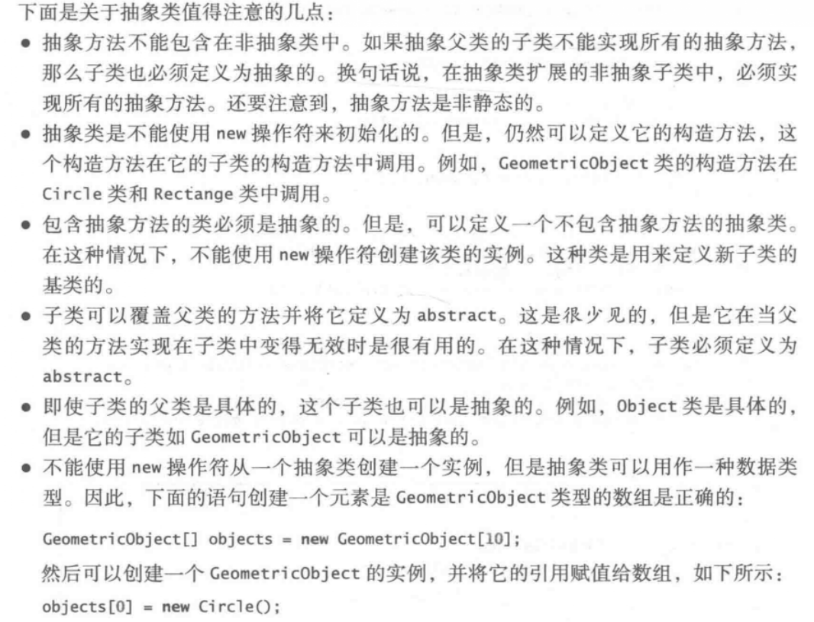
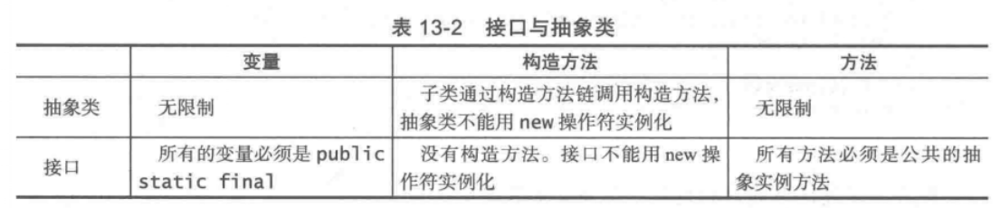
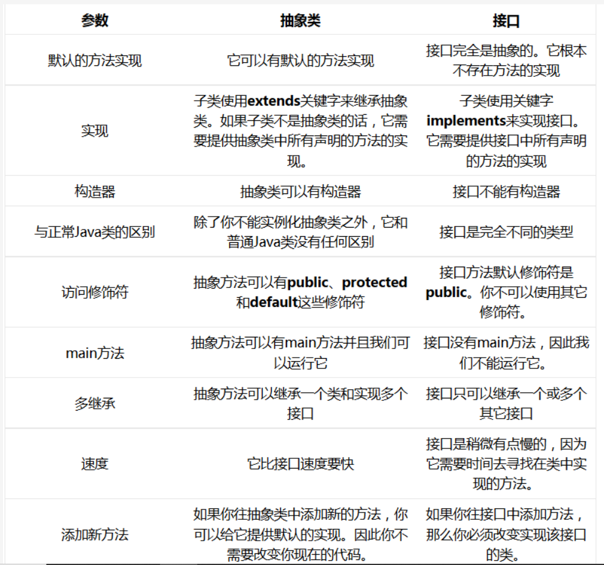

# 抽象类和接口

## 1.引言

父类定义了相关子类的共同行为，而接口则定义了类的共同行为(也包括非相关的类)  

## 2.抽象类

抽象类不可以直接用于创建对象。抽象类可以包含抽象方法，这些方法将在具体的子类中实现  
  

## 3.接口

接口在许多方面都与抽象类相似，但他的目的是指定相关或者不相关的类的多个对象的共同行为  
与抽象类相似，不可以使用new创建接口的实例  
类和接口之间的关系称为接口继承  

  
  
另外，类的拓展只能是单一继承，但是接口可以继承多个其他接口  
