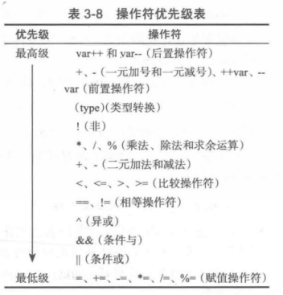

## 第三章笔记
# 常见错误
1. 两个浮点数值的相等测试。浮点数具有有限的计算精度；涉及浮点数的计算可能引人取整错误。因此，两个浮点数值的相等测试并不可靠;例子见***Third_1.java*** ***10~~20***行

# random 
使用Math.random() 可以得到**0<= x < 1.0**的随机数

# switch
1. switch 语句遵从下述规则： ① switch 表达式必须能计算出一个 ***char、byte、short,int 或者 String 型值***(C++中不能用String，注意区别)，并且必须总是要用括号括住。（char 和 String 类型将在下一章介绍。）
2. valuel，...，valueN 必须与 switch 表 达 式 的 值 具 有 相 同 的 数 据 类 型。注 意：valuel, valueN 都是常量表达式，也就是说这里的表达式是不能包含变量的，例如，不
允许出现 1+X.
3. 当 switch 表达式的值与 case 语句的值相匹配时，执行从该 case 开始的语句，直到遇到一个 break 语句或到达该 switch 语句的结束。
4. 默认情况（default)是可选的，当没有一个给出的 case 与 switch 表达式匹配时，用来执行该操作。
5. 关键字 break 是可选的。break 语句会立即终止 switch 语句

# 优先级
