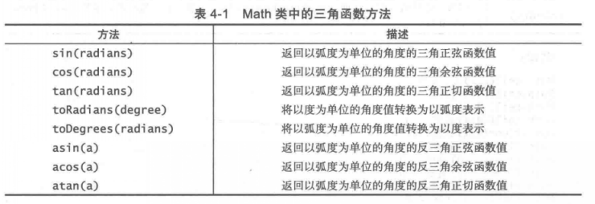
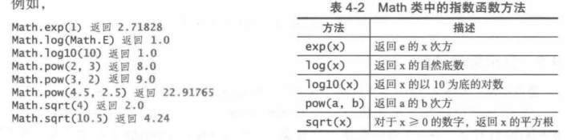
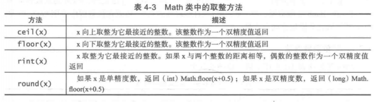
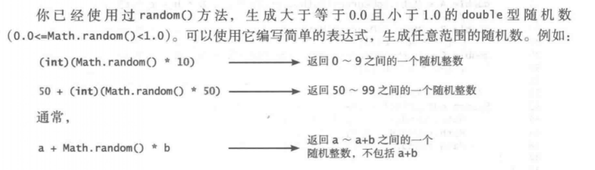
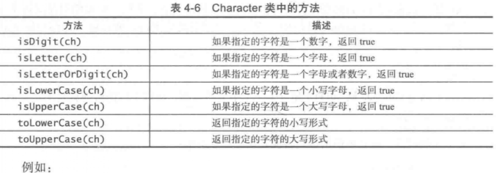
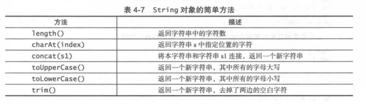
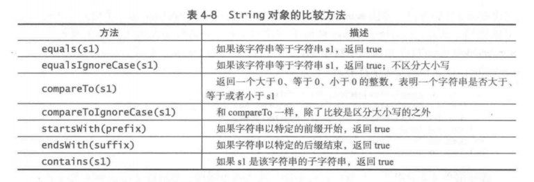
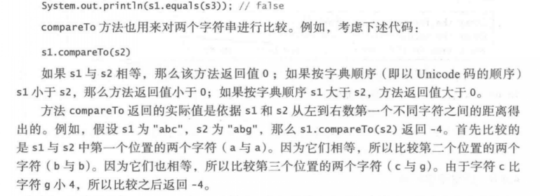
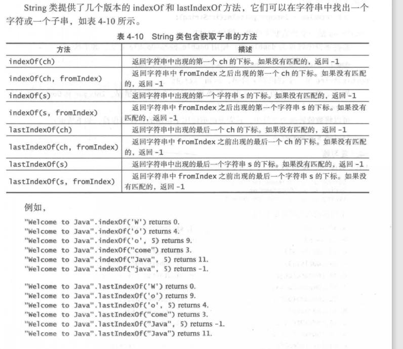

# 第四章笔记
## 数学函数
1.三角函数

2.指数函数

3.取整方法

4.random方法

## 字符数据类型
### Unicode
Java 支持16位的Unicode码，以及其扩充的补充字符码

Unicode 范围从'\u0000'~~'\uFFFF'码
其中'\u0000'~~'\u007F'包含了ASCII码的内容

### Character Class

## String
### 常用的一些方法

### 实例方法和静态方法
例如String中的方法，需要通过具体对象的实例来调用，这些方法就成为***实例方法***。

而非实例方法又称作***静态方法***，比如Math类的方法都是静态方法。他们没有绑定到一个特定的对象实例上。

### String 的比较方法

