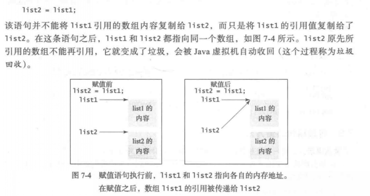

# 数组

## 一维数组
### 声明
声明的语法：  
elementType [] arrayName;  
不同于基本数据类型变量的声明，声明一个数组变量时并不在内存中给数组分配任何空间。它只是创建一个对数组的引用的存储位置。如果变量不包含对数组的引用，那么这个变量的值为 null。除非数组已经被创建，否则不能给它分配任何元素。  
当**创建数组后**，它的元素被賦予默认值，数值型基本数据类型的默认值为 0, char 型的默认值为 AuOOOO’，boolean 型的默认值为 false。

### 引用赋值

### 赋值数组的方法
1 ) 使用循环语句逐个地复制数组的元素  
2 ) 使用 System 类中的静态方法 arraycopy  
3 )使用 clone 方法复制数组，这将在第 13 章中介绍

### 方法中传递数组
对于数组类型参数，参数值是数组的引用，给方法传递的是这个引用。从语义上来讲，最好的描述就是参教传递的是共享信息（pass-by-sharing), 即方法中的数组和传递的数组是一样的。所以，如果改变方法中的数组，将会看到方法外的数组也变化了。

### 可变长参数列表
方法中的参数声明如下：  
***typeName… parameterName ( 类 型 名 … 参 数 名 ）***  
在方法声明中，指定类型后紧跟着省略号（...)。只能给方法中指定一个可变长参数，同时该参数必须是最后一个参数。任何常规参数必须在它之前。

### Arrays 类
可以使用 sort 或者 parallelSort方法对整个数组或部分数组进行排序。  
***java.util.Arrays.sort(numbers);***
可以调用sort(numbers)对整个数组 numbers 排序。可以调用sort(chars，l, 3)对从chars[l]到 charS[3-l]的部分数组排序。如果你的计算机有多个处理器，那么 parallelSort将更加高效。