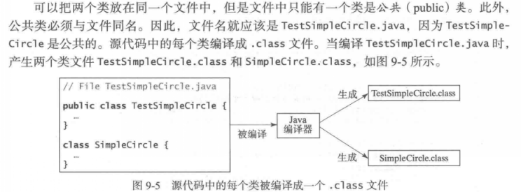
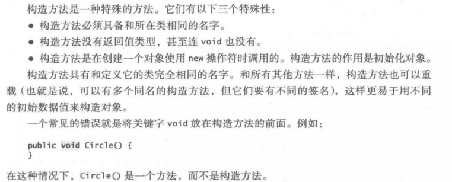
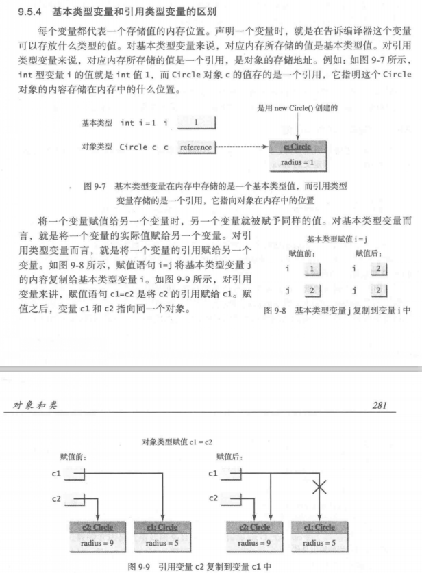
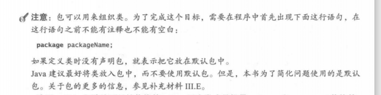
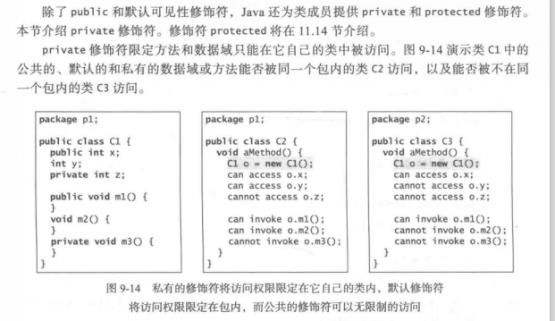
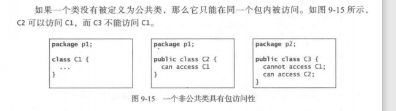
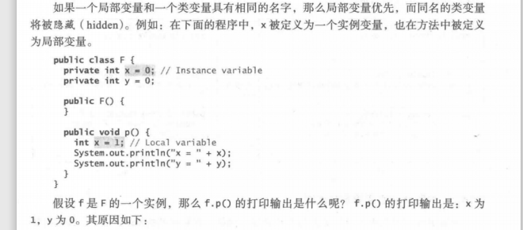

# 对象和类
## 两个类放在同一个文件里

## 构造方法

## 引用变量和引用类型
以下语句可以创建一个对象，并且将他的引用赋值给变量myCircle  
Circle mycircle = new Circle();  
变量mycircle里面存储的是Circle的一个引用    

## 引用数据域与null值
引用类型数据域的默认值是 rum, 数值类型数据域的默认值是 0, boolean 类型数据域的默认值是 false, 而 char 类型数据域的默认值是 ’\u0000'

## 静态变量、常量和方法
静态变量被类中的所有对象所共享。静态方法不能访问类中的实例成员  
Circle 类的数据域 radius 称为一个实例变量。实例变M是绑定到类的某个特定实例的。它是不能被同一个类的不同对象所共享的。  
类中的常量是被该类的所有对象所共享的。因此，常量应该声明为 final static, 例如Math 类中的常量 PI 是如下定义的：
final static double PI = 3.1415926535S979323846;  

实例方法可以调用实例方法和静态方法，以及访问实例数据域或者静态数据域。静态方法可以调用静态方法以及访问静态数据域。然而，静态方法不能调用实例方法或者访问实例数据域，因为静态方法和静态数据域不属于某个特定的对象。  

## 可见性修饰符
可以在类、方法、数据域前面使用public修饰符，表明可以被其他的任何类使用。如果没有使用可见性修饰符，那么则默认类、方法和数据域是可以被*同一个包*中的任何一个类访问的。  

包：  

## private、public、默认(package-private)

## 不可变的类和对象

## 类变量(数据域)的作用域
如果一个局部变量和一个类变量具有相同的名字，那么局部变量优先. 而同名的类变量将被隐藏（ hidden)

## this
隐藏的静态变量可以简单地通过 “类名 .静态变量” 的方式引用。隐藏的实例变量就需要使用关键字 this 来引用，