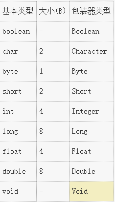

# 一切都是对象

## 1. 用引用操纵对象

在Java里面，我们声明的操纵的标识符其实是对象的一个引用,比如`String s = new String()`  
里面`s`就是对象的一个引用而非对象本身。

## 2. 必须由你创建对象

### 1. 程序中，常见的存储位置有

1. 寄存器
2. 堆栈
3. 堆
4. 常量存储:比如ROM
5. 外存

### 2. 特例：基本类型

在Java中，基本类型不使用new来创建。他们直接存储在堆栈中，并且***Java中基本类型的大小是确定的***，并不会随着机器的类型变化而变化。



Java中没有无符号类型

基本类型都有其包装器类型，通过自动装箱拆箱来自动转换。

高精度数字类型：BigDecimal， BigInteger。

Java中的数组不允许越界访问。

## 3. 不需要手动销毁对象

在Java中作用域由花括号决定，如
```Java
int x  = 12;
// x 可用
{
    int y = 1;
    // x and y available
}
// Only x available
```

但是如下形式不被允许(不同于C++)
```Java
int x  = 12;
// x 可用
{
    // int x = 1;
    // invalid
}
```

***对象的作用域不受花括号限制***

```Java
{
    String s = new String("hello");
    // s available
}
// s still available
```

## 4. Class
一个类包含两个类型的元素
1. 字段(数据成员)
2. 方法

基本成员默认值:false, 0, '\u0000'(null)

## 5. 方法,参数和返回值
方法的基本组成元素:名称,参数列表,返回值和方法.Java的方法只能作为类的一部分创建

## 6. 创建一个Java程序

### 1. 名字可见性

通过package的办法完成名称空间,减少名称冲突. 包的名字采用小写. 需要使用其他包的时候用import导入.

### 2. static

static对象不和类的对象实例绑定,可以通过`ClassName.StaticName` 或者 `object.StaticName` 访问